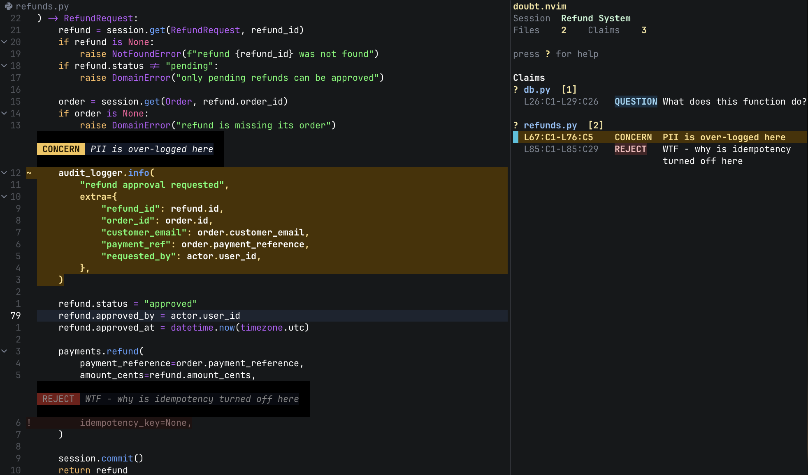

# doubt.nvim



`doubt.nvim` is a Neovim plugin for reviewing (AI-generated) code with a focus on inline comments and persistent sessions.
It helps you mark questionable, risky, or incorrect parts of code directly in the buffer, so review findings stay visible and actionable.

**Finished reviewing outputs?**: `doubt.nvim` allows you to export all your claims to a **structured XML format** together with configurable **prompt templates**
that wrap your findings with (follow-up) instructions for coding assistants.

Instead of relying on memory, vague intuition or imprecise references, you can attach review claims directly to the code while you inspect it.

Three kinds of claims are included by default:

- `question` for code that needs an explanation
- `concern` for code that seems risky, unclear, or worth closer inspection
- `reject` for code that is wrong, misleading, or not ready to ship

The claim system is also **easy to extend** and configure for your own review workflow.

Review state is session-based, so findings persist across review passes.

**The best part:** Even if edits are made to the file, either by you or an AI, line references of claims get automatically updated.
If the code marked by a claim gets modified it gets marked as stale and is excluded from exports unless it is updated.

## Why it was built

`doubt.nvim` is meant for code review, with AI-generated outputs in mind.

As code is increasingly being generated by AI we need to be careful and remain aware of what generated code actually entails.
State-of-the-art models have reached the point where they almost always write code that works, but still contains subtle mistakes, hacky workarounds, or misses crucial edge cases.

`doubt.nvim` is supposed to make the review process more deliberate.

The workflow is simple:

- an agent (or coworker) writes code
- you create a doubt session to review it
- you mark what needs explanation, what is potentially concerning, and whats straight up broken
- your review notes persist across sessions and edits to other areas
- when you are done you either:
    - Manually go through each claim and adress it
    - or export your findings to a coworker or AI coding assisant of your choice

## Installation

**Requirements:** Neovim 0.10+ and [`MunifTanjim/nui.nvim`](https://github.com/MunifTanjim/nui.nvim) (required for prompt UI).

With `lazy.nvim`:

```lua
{
  "makefinks/doubt.nvim",
  dependencies = { "MunifTanjim/nui.nvim" },
  config = function()
    require("doubt").setup()
  end,
}
```

Call `require("doubt").setup()` during plugin setup to register commands, keymaps, highlights, and autocmds.
Pass options there to override defaults such as keymaps, export templates, claim kinds, panel options, or input behavior.

**First-run check:** After installation, run `:DoubtPanel` to verify the plugin loaded and commands registered correctly. You should see an empty panel.

## Commands

Main review actions:

- `:DoubtQuestion [note]`
- `:DoubtConcern [note]`
- `:DoubtReject [note]`
- `:DoubtClaim <kind> [note]`
- `:DoubtClaimDelete`
- `:DoubtClaimKind <kind>`
- `:DoubtClaimNote [note]`
- `:DoubtClaimToggle`
- `:DoubtPanel`
- `:DoubtExport [template]`
- `:DoubtExportFilter`
- `:DoubtExportXml`
- `:DoubtHealthcheck`
- `:DoubtClearBuffer`
- `:DoubtRefresh`
- `:DoubtState`

Session management:

- `:DoubtSessionNew [name]`
- `:DoubtSessionResume [name]`
- `:DoubtSessionStop`
- `:DoubtSessionDelete [name]`
- `:DoubtSessionRename [name] [new_name]`

Without an explicit range, `:DoubtQuestion`, `:DoubtConcern`, `:DoubtReject`, and `:DoubtClaim <kind>` operate on the current line. With a visual or Ex range, they use that range instead.
If you omit `[note]`, an inline note popup asks for one.

`:DoubtExport` copies the active session to the configured register using the default export template, or a named template override when you pass one. It exports only trusted claims (`fresh`/`reanchored`) and reports skipped stale claims.

`:DoubtExportFilter` opens a separate command-only picker, lets you choose which claim kinds to include, and then copies raw XML for just those selected kinds. 

Built-in templates:

- `raw` keeps the one-step export path as compact XML
- `review` wraps the same mixed-claim XML with single-agent review instructions for ai assistants
- `multi_agent` wraps the same mixed-claim XML with coordinator-style triage instructions for ai assistants

Template names are exposed as command completion so custom handoff wrappers stay discoverable.

`:DoubtExportXml` opens the full active session as compact XML grouped by file into a scratch XML buffer when you want to inspect the raw export.

## Default Keymaps

- `<leader>Dq` question the current line or selection
- `<leader>Dc` flag concern on the current line or selection
- `<leader>Dr` reject the current line or selection
- `<leader>Dp` toggle the panel
- `<leader>De` copy the active session handoff (default: review template)
- `<leader>DE` open template picker, then copy handoff
- `<leader>Db` clear all doubt claims for the current buffer
- `<leader>Dd` delete claim nearest to the cursor
- `<leader>Dm` modify claim note nearest to the cursor
- `<leader>Dk` modify claim kind nearest to the cursor
- `<leader>Dt` toggle expanded claim note nearest to the cursor
- `<leader>Dn` start a new session
- `<leader>Ds` resume a saved session
- `<leader>Dx` stop the active session
- `<leader>Df` refresh decorations and panel state

Set `keymaps = false` to disable all defaults, or disable individual entries one by one.

## Configuration

Current default configuration:

```lua
require("doubt").setup({
  export = {
    default_template = "review",
    instructions = {
      question = "Explain the code and address the feedback without modifying the code.",
      concern = "Investigate the concern, explain whether it is valid, and revise the code if needed.",
      reject = "Remove or replace the code according to the feedback.",
    },
    register = "+",
    templates = {
      raw = "{{xml}}",
      review = table.concat({
        "The reviewer has provided feedback for the code in the xml below.",
        "Fetch every referenced file and line from the repository before performing claim specific actions.",
        "Also fetch any additional context from the codebase that may be relevant to the claim and your response.",
        "",
        "{{xml}}",
        "",
        "Format each claim as a separate section with a single horizontal divider line containing a centered CLAIM 1, CLAIM 2, and so on header.",
        "Under that, include labeled metadata lines for File and Claim Note using the exact file path, line range, kind, and claim note text from the xml.",
        "Also include the code context for each claim when the claim references fewer than 10 lines of code.",
        "Render code context as plain line-numbered code inside a fenced code block.",
        "Use a visible box-style top border above the code block and a matching bottom border below it, sized to the code block width.",
        "Use border lines only above and below the block, never at the left or right edge of each code line.",
        "Then provide the response for that claim directly below.",
      }, "\n"),
      multi_agent = table.concat({
        "You are coordinating a response to feedback the reviewer has provided.",
        "Fetch every referenced file and line from the repository before assigning claim specific work.",
        "Also fetch any additional context from the codebase that may be relevant to the claim and your response.",
        "Triage each claim, delegate explanation or revision work as needed, and return one consolidated response.",
        "You should act as a coordinator that delegates work and consolidates the individual responses from subagents into a final response for the user.",
        "",
        "{{xml}}",
        "",
        "In the final consolidated response, format each claim as a separate section with a single horizontal divider line containing a centered CLAIM 1, CLAIM 2, and so on header.",
        "Under that, include labeled metadata lines for File and Claim Note using the exact file path, line range, kind, and claim note text from the xml.",
        "In the final consolidated response, also include the code context for each claim when the claim references fewer than 10 lines of code.",
        "Render code context in the final consolidated response as plain line-numbered code inside a fenced code block.",
        "Use a visible box-style top border above the code block and a matching bottom border below it, sized to the code block width.",
        "Use border lines only above and below the block, never at the left or right edge of each code line.",
        "If you delegate work, require subagents to preserve the exact claim identifiers in their responses.",
        "Then provide the response for that claim directly below.",
      }, "\n"),
    },
  },
  input = {
    border = "rounded",
    prompts = {
      question = "Question note: ",
      concern = "Concern note: ",
      reject = "Reject note: ",
    },
    width = 50,
  },
  claim_kinds = {
    question = {
      command = "Question",
      default_note = "question",
      description = "Question current line or selection",
      label = "?",
      order = 10,
      styles = {
        inline_label = { fg = "#08141F", bg = "#7DD3FC", bold = true },
        inline_text = { fg = "#F5F5F5", bg = "#111827", italic = true },
        mark = { fg = "#9DDCFA", bg = "#173042", bold = true },
      },
    },
    concern = {
      command = "Concern",
      default_note = "concern",
      description = "Flag concern on current line or selection",
      label = "~",
      order = 15,
      styles = {
        inline_label = { fg = "#201600", bg = "#F6C453", bold = true },
        inline_text = { fg = "#F5F5F5", bg = "#111827", italic = true },
        mark = { fg = "#FFE08A", bg = "#4A3200", bold = true },
      },
    },
    reject = {
      command = "Reject",
      default_note = "reject",
      description = "Reject current line or selection",
      label = "!",
      order = 20,
      styles = {
        inline_label = { fg = "#FFF5F5", bg = "#FF3B30", bold = true },
        inline_text = { fg = "#F5F5F5", bg = "#111827", italic = true },
        mark = { fg = "#FFC2C2", bg = "#442526", bold = true },
      },
    },
  },
  inline_notes = {
    enabled = true,
    max_width = 60,
    prefix = "",
    padding_right = 2,
  },
  keymaps = {
    question = "<leader>Dq",
    concern = "<leader>Dc",
    reject = "<leader>Dr",
    claims = {},
    delete_claim = "<leader>Dd",
    edit_kind = "<leader>Dk",
    edit_note = "<leader>Dm",
    toggle_claim = "<leader>Dt",
    export = "<leader>De",
    clear_buffer = "<leader>Db",
    panel = "<leader>Dp",
    session_new = "<leader>Dn",
    session_resume = "<leader>Ds",
    stop_session = "<leader>Dx",
    refresh = "<leader>Df",
  },
  panel = {
    width = 56,
    side = "right",
  },
  state_path = vim.fs.joinpath(vim.fn.stdpath("state"), "doubt.nvim.json"),
  signs = {
    file = "?",
    question = "?",
    concern = "~",
    reject = "!",
  },
})
```

Export templates support `{{xml}}`, `{{session}}` / `{{session_name}}`, `{{file_count}}`, and `{{claim_count}}`, so you can wrap the raw XML in agent-specific instructions
without changing the underlying export shape.

`keymaps.export_picker` defaults to `<leader>DE` when omitted. Set it explicitly (or to `false`) under `keymaps` to change that behavior.

Custom claim kinds are configured through `claim_kinds`, plus matching `input.prompts`, `signs`, and optional `keymaps.claims` entries.
Each kind gets a generic `:DoubtClaim <kind>` path. If you define a kind like: `command = "Blocker"`, it also registers `:DoubtBlocker` automatically.

```lua
require("doubt").setup({
  claim_kinds = {
    blocker = {
      command = "Blocker",
      label = "X",
      default_note = "blocker",
      order = 30,
      styles = {
        mark = { fg = "#FFD1D1", bg = "#4B1717", bold = true },
        inline_label = { fg = "#FFF5F5", bg = "#C53030", bold = true },
        inline_text = { fg = "#F5F5F5", bg = "#000000", italic = true },
      },
    },
  },
  input = {
    prompts = {
      blocker = "Blocker note: ",
    },
  },
  signs = {
    blocker = "X",
  },
  keymaps = {
    claims = {
      blocker = "<leader>Dz",
    },
  },
})
```

### Export Templates
By default export can use `raw`, `review`, and `multi_agent` templates. `review` is the default unless you point `export.default_template` at a different named template.

You can still add your own named templates alongside the built-ins:

```lua
require("doubt").setup({
  export = {
    templates = {
      escalate = "Escalate this review.\n\n{{xml}}",
    },
  },
})
```

That custom template is then available through `:DoubtExport escalate`.

## Contributing

All contributions are welcome.

> Doubt.nvim was heavily written with the help of ai - feel free to use it to report issues
