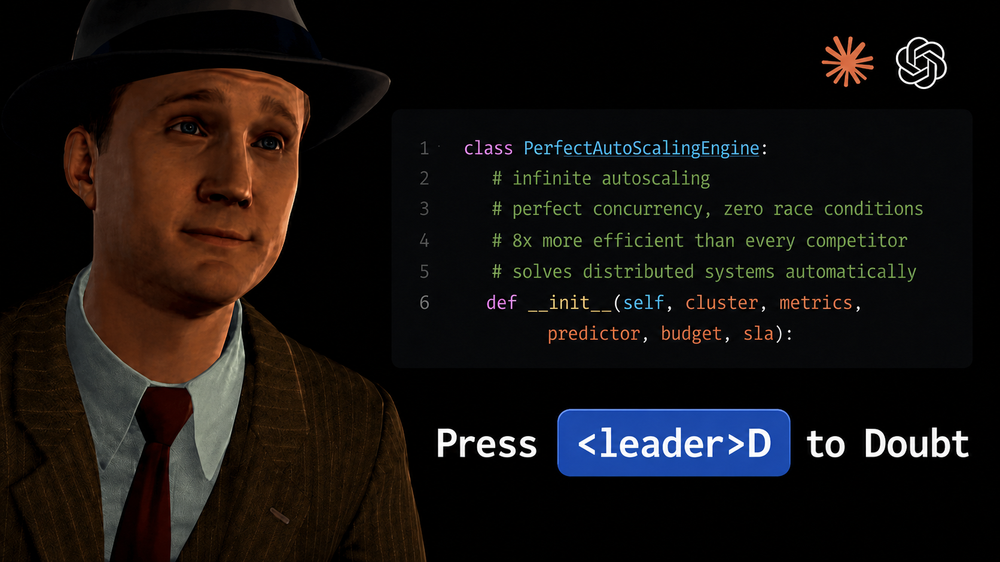
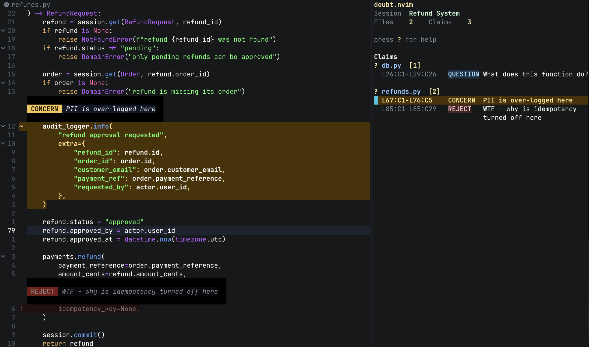

# doubt.nvim

<p align="center">
	
</p>

`doubt.nvim` is a Neovim plugin for reviewing (AI-generated) code with a focus on inline comments and persistent sessions.
It helps you mark questionable, risky, or incorrect parts of code directly in the buffer, so review findings stay visible and actionable.

Agents can also write review findings in a format that `doubt.nvim` can read, so AI-generated reviews can be inspected, edited, refreshed, and exported from inside Neovim instead of living only in chat output.

**Finished reviewing outputs?** `doubt.nvim` lets you export all your claims to a **structured XML format** together with configurable **prompt templates**
that wrap your findings with (follow-up) instructions for coding assistants.

Instead of relying on memory, vague intuition or imprecise references, you can attach review claims directly to the code while you inspect it.

Three kinds of claims are included by default:

- `question` for code that needs an explanation
- `concern` for code that seems risky, unclear, or worth closer inspection
- `reject` for code that is wrong, misleading, or not ready to ship

The claim system is also **easy to extend** and configure for your own review workflow.

Review state is session-based, so findings persist across review passes.

Even if you or an AI edit the file, claim line references are updated automatically.
If the code marked by a claim changes, the claim is marked as stale and excluded from exports until it is updated.

## Usage



## Why it was built

<p align="center"><em>"The first principle is that you must not fool yourself—and you are the easiest person to fool."</em><br>— Richard Feynman</p>

`doubt.nvim` is meant for code review, with AI-generated outputs in mind.

As code is increasingly being generated by AI, we need to be careful and remain aware of what generated code actually entails.
State-of-the-art models have reached the point where they almost always write code that works, but they still make subtle mistakes, rely on hacky workarounds, and miss crucial edge cases.

`doubt.nvim` is supposed to make the review process more deliberate.

The workflow is simple:

- an agent (or coworker) writes code
- you create a doubt session to review it
- you mark what needs explanation, what is potentially concerning, and what's straight up broken
- your review notes persist across sessions and edits to other areas
- when you are done you either:
    - Manually go through each claim and address it
    - or export your findings to a coworker or AI coding assistant of your choice

## Installation

**Requirements:** Neovim 0.10+ and [`MunifTanjim/nui.nvim`](https://github.com/MunifTanjim/nui.nvim) (required for prompt UI).

With `lazy.nvim`:

```lua
{
  "makefinks/doubt.nvim",
  dependencies = { "MunifTanjim/nui.nvim" },
  config = function()
    require("doubt").setup()
  end,
}
```

Call `require("doubt").setup()` during plugin setup to register commands, keymaps, highlights, and autocmds.
Pass options there to override defaults such as keymaps, export templates, claim kinds, panel options, or input behavior.

**First-run check:** After installation, run `:DoubtPanel` to verify the plugin loaded and commands registered correctly. You should see an empty panel.

## Commands

Main review actions:

- `:DoubtQuestion [note]`
- `:DoubtConcern [note]`
- `:DoubtReject [note]`
- `:DoubtClaim <kind> [note]`
- `:DoubtClaimDelete`
- `:DoubtClaimKind <kind>`
- `:DoubtClaimNote [note]`
- `:DoubtClaimToggle`
- `:DoubtPanel`
- `:DoubtExport [template]`
- `:DoubtExportFilter`
- `:DoubtExportXml`
- `:DoubtAgentInstructionsCopy`
- `:DoubtHealthcheck`
- `:DoubtClearBuffer`
- `:DoubtRefresh`
- `:DoubtState`

Session management:

- `:DoubtSessionNew [name]`
- `:DoubtSessionResume [name]`
- `:DoubtSessionStop`
- `:DoubtSessionDelete [name]`
- `:DoubtSessionRename [name] [new_name]`

Workspace session management:

- `:DoubtWorkspaceSessionNew [name]`
- `:DoubtWorkspaceSessionResume [name]`
- `:DoubtWorkspaceSessionDelete [name]`
- `:DoubtWorkspaceSessionRename [name] [new_name]`

Without an explicit range, `:DoubtQuestion`, `:DoubtConcern`, `:DoubtReject`, and `:DoubtClaim <kind>` operate on the current line. With a visual or Ex range, they use that range instead.
If you omit `[note]`, an inline note popup asks for one.
Type `@` in the note popup to reference a project file. In Git repositories, the picker lists tracked and non-ignored untracked files from the repository root; elsewhere, it scans the current working directory. The picker uses `vim.ui.select`, so any configured UI selector can provide the interface without being a doubt.nvim dependency.

`:DoubtExport` copies the active session to the configured register using the default export template, or a named template override when you pass one. It exports only trusted claims (`fresh`/`reanchored`) and reports skipped stale claims.

In a Git repository, `:DoubtExport` also creates a review-run checkpoint. The checkpoint represents the exact working tree at handoff time, including existing uncommitted and untracked non-ignored files, without changing the real index or current branch. The payload gives every claim a stable ID and tells the agent where to write its claim-to-change manifest.

`:DoubtExportFilter` opens a separate command-only picker, lets you choose which claim kinds to include, and then copies raw XML for just those selected kinds.

Built-in templates:

- `raw` keeps the one-step export path as compact XML
- `review` wraps the same mixed-claim XML with single-agent review instructions for AI assistants
- `multi_agent` wraps the same mixed-claim XML with coordinator-style triage instructions for AI assistants

Template names are exposed as command completion so custom handoff wrappers stay discoverable.

`:DoubtExportXml` opens the full active session as compact XML grouped by file into a scratch XML buffer when you want to inspect the raw export.

`:DoubtAgentInstructionsCopy` copies instructions for agents that should write review findings directly into a repo-local workspace session.

### Claim-scoped agent diffs

After an agent handles an exported review, refresh or reopen `:DoubtPanel` to see its response beneath each claim. The panel distinguishes completed changes, answers, rejected concerns, and unresolved feedback while warning about changes that could not be matched to a claim.

For claims with verified changes, press `D` to inspect only the relevant diff. doubt.nvim can use CodeDiff, Diffview, or its built-in diff view; choose a preferred viewer with `review_runs.diff_viewer` in the configuration below. Claim-scoped diffs are available when exporting from a Git repository.

### Agent-written workspace sessions

Workspace sessions are stored under `.doubt/sessions/<session-name>/` in the repository. They are intended for cases where an agent or external reviewer writes structured findings that you want to inspect in Neovim with the normal doubt panel, marks, stale/reanchored status, editing commands, and exports.

The claim files mirror repo-relative source paths under `claims/` and append `.json`:

```text
.doubt/sessions/ai-review-findings/
  session.json
  claims/lua/doubt/init.lua.json
```

For a source file `lua/doubt/init.lua`, the per-file claim JSON contains the same repo-relative path:

```json
{
  "schema_version": 1,
  "file": "lua/doubt/init.lua",
  "claims": [
    {
      "id": "ai-001",
      "kind": "concern",
      "start_line": 49,
      "start_col": 1,
      "end_line": 49,
      "end_col": 20,
      "note": "Explain the concrete issue and why it matters."
    }
  ]
}
```

Use `:DoubtAgentInstructionsCopy` or `<leader>Da` to copy the exact instructions for an agent. Then open the result with `:DoubtWorkspaceSessionResume <session-name>`.

## Default Keymaps

- `<leader>Dq` question the current line or selection
- `<leader>Dc` flag concern on the current line or selection
- `<leader>Dr` reject the current line or selection
- `<leader>Dp` toggle the panel
- `<leader>De` copy the active session handoff (default: review template)
- `<leader>DE` open template picker, then copy handoff
- `<leader>Da` copy instructions for agent-written workspace review sessions
- `<leader>Db` clear all doubt claims for the current buffer
- `<leader>Dd` delete claim nearest to the cursor
- `<leader>Dm` modify claim note nearest to the cursor
- `<leader>Dk` modify claim kind nearest to the cursor
- `<leader>Dt` toggle expanded claim note nearest to the cursor
- `<leader>Dn` start a new session
- `<leader>Ds` resume a saved session
- `<leader>Dx` stop the active session
- `<leader>Df` refresh decorations and panel state

Inside the panel, press `D` on a claim to open the agent-attributed changes from the run that most recently included that claim.

Set `keymaps = false` to disable all defaults, or disable individual entries one by one.

## Configuration

Current default configuration:

```lua
require("doubt").setup({
  export = {
    default_template = "review",
    instructions = {
      question = "Explain the code and address the feedback without modifying the code.",
      concern = "Investigate the concern, explain whether it is valid, and revise the code if needed.",
      reject = "Remove or replace the code according to the feedback.",
    },
    register = "+",
    templates = {
      raw = "{{xml}}",
      review = table.concat({
        "The reviewer has provided feedback for the code in the xml below.",
        "Fetch every referenced file and line from the repository before performing claim specific actions.",
        "After addressing the claims and writing any required results manifest, give a concise textual implementation summary without repeating a claim-by-claim report.",
        "",
        "{{xml}}",
      }, "\n"),
      multi_agent = table.concat({
        "You are coordinating a response to feedback the reviewer has provided.",
        "Fetch every referenced file and line from the repository before assigning claim specific work.",
        "Triage each claim and delegate explanation or revision work as needed.",
        "You should act as a coordinator that delegates work and consolidates the individual responses from subagents into a final response for the user.",
        "After addressing the claims and writing any required results manifest, give a concise textual implementation summary without repeating a claim-by-claim report.",
        "",
        "{{xml}}",
      }, "\n"),
    },
  },
  input = {
    border = "rounded",
    prompts = {
      question = "Question note: ",
      concern = "Concern note: ",
      reject = "Reject note: ",
    },
    width = 50,
    height = 3,
  },
  claim_kinds = {
    question = {
      command = "Question",
      default_note = "question",
      description = "Question current line or selection",
      label = "?",
      order = 10,
      styles = {
        inline_label = { fg = "#08141F", bg = "#7DD3FC", bold = true },
        inline_text = { fg = "#F5F5F5", bg = "#111827", italic = true },
        mark = { fg = "#9DDCFA", bg = "#173042", bold = true },
      },
    },
    concern = {
      command = "Concern",
      default_note = "concern",
      description = "Flag concern on current line or selection",
      label = "~",
      order = 15,
      styles = {
        inline_label = { fg = "#201600", bg = "#F6C453", bold = true },
        inline_text = { fg = "#F5F5F5", bg = "#111827", italic = true },
        mark = { fg = "#FFE08A", bg = "#4A3200", bold = true },
      },
    },
    reject = {
      command = "Reject",
      default_note = "reject",
      description = "Reject current line or selection",
      label = "!",
      order = 20,
      styles = {
        inline_label = { fg = "#FFF5F5", bg = "#FF3B30", bold = true },
        inline_text = { fg = "#F5F5F5", bg = "#111827", italic = true },
        mark = { fg = "#FFC2C2", bg = "#442526", bold = true },
      },
    },
  },
  inline_notes = {
    enabled = true,
    max_width = 80,
    prefix = "",
    padding_right = 2,
  },
  keymaps = {
    agent_instructions = "<leader>Da",
    question = "<leader>Dq",
    concern = "<leader>Dc",
    reject = "<leader>Dr",
    claims = {},
    delete_claim = "<leader>Dd",
    edit_kind = "<leader>Dk",
    edit_note = "<leader>Dm",
    toggle_claim = "<leader>Dt",
    export = "<leader>De",
    clear_buffer = "<leader>Db",
    panel = "<leader>Dp",
    session_new = "<leader>Dn",
    session_resume = "<leader>Ds",
    stop_session = "<leader>Dx",
    refresh = "<leader>Df",
  },
  panel = {
    width = 56,
    side = "right",
  },
  review_runs = {
    diff_viewer = "auto",
  },
  state_path = vim.fs.joinpath(vim.fn.stdpath("state"), "doubt.nvim.json"),
  signs = {
    file = "?",
    question = "?",
    concern = "~",
    reject = "!",
  },
})
```

Export templates support `{{xml}}`, `{{session}}` / `{{session_name}}`, `{{file_count}}`, and `{{claim_count}}`.
This lets you wrap the raw XML in agent-specific instructions without changing the underlying export shape.

`keymaps.export_picker` defaults to `<leader>DE` when omitted. Set it explicitly (or to `false`) under `keymaps` to change that behavior.

Custom claim kinds are configured through `claim_kinds`, plus matching `input.prompts`, `signs`, and optional `keymaps.claims` entries.
Each kind gets a generic `:DoubtClaim <kind>` path. If you define a kind like: `command = "Blocker"`, it also registers `:DoubtBlocker` automatically.

`inline_notes.max_width` controls both the collapsed note truncation cutoff and expanded note wrap width. Increase it if claim notes hide too early, or set it to `0` to disable width-based truncation/wrapping.

```lua
require("doubt").setup({
  claim_kinds = {
    blocker = {
      command = "Blocker",
      label = "X",
      default_note = "blocker",
      order = 30,
      styles = {
        mark = { fg = "#FFD1D1", bg = "#4B1717", bold = true },
        inline_label = { fg = "#FFF5F5", bg = "#C53030", bold = true },
        inline_text = { fg = "#F5F5F5", bg = "#000000", italic = true },
      },
    },
  },
  input = {
    prompts = {
      blocker = "Blocker note: ",
    },
  },
  signs = {
    blocker = "X",
  },
  keymaps = {
    claims = {
      blocker = "<leader>Dz",
    },
  },
})
```

### Export Templates
By default export can use `raw`, `review`, and `multi_agent` templates. `review` is the default unless you point `export.default_template` at a different named template.

You can still add your own named templates alongside the built-ins:

```lua
require("doubt").setup({
  export = {
    templates = {
      escalate = "Escalate this review.\n\n{{xml}}",
    },
  },
})
```

That custom template is then available through `:DoubtExport escalate`.

## Contributing

All contributions are welcome.

> Doubt.nvim was written largely with the help of AI. Feel free to use it to report issues.
